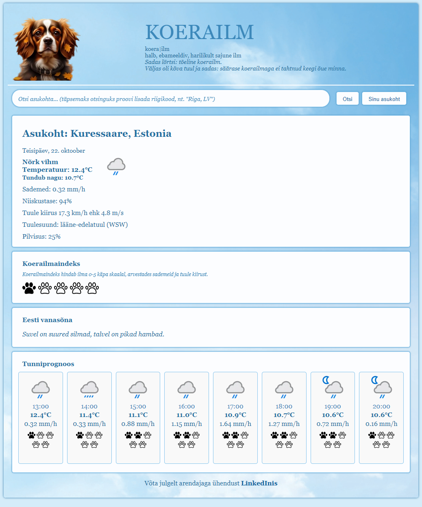

# Koerailm weather app - final project for SDA Python Course "PythonRemoteEE23"
Koerailm is a simple weather app, displaying current weather and hourly forecast, as well as easy-to-understand
dog weather index and Estonian folk sayings as this is mostly targeted to Estonian users.
The webpage allows users to search for a location by name or get user's current location by latitude and longitude. 
The dog weather index is a fun and unique tool for quickly evaluating weather conditions, 
taking into account the amount of rainfall and wind speed (as it is defined in the word - koerailm).
Koerailm is the final project for SDA Python Course "PythonRemoteEE23" developed during autumn 2024.



_______________________________________________________________________________________________________________________
## Technologies used
* Language: Python 3.12
* Framework: Django 5.1
* GIT
* REST API
_______________________________________________________________________________________________________________________
## Installation steps
### 1. Clone the repository:
```bash
git clone https://github.com/KarolaRaid/koerailm-weather-app
cd koerailm-weather-app
```
### 2. Create and activate virtual environment
#### On Windows
```bash
python -m venv venv
venv\Scripts\activate
```
#### On MacOS/Linux
```bash
python -m venv venv
source venv/bin/activate
```
### 3. Install dependencies
```bash
pip install -r requirements.txt
```
### 4. Create a .env file
In the root directory of the project, create a .env file with the content based on the example.env file.

### 5. Apply migrations
```bash
python manage.py migrate
```

### 6. Start the development server
You can now run the development server using the following command:
```bash
python manage.py runserver
```
Visit http://127.0.0.1:8000/ in your browser to see the website.

_______________________________________________________________________________________________________________________
## Testing
Run the tests with the following command:
```bash
pytest
```
_______________________________________________________________________________________________________________________
## Credits
This project was developed by Karola Raid.
