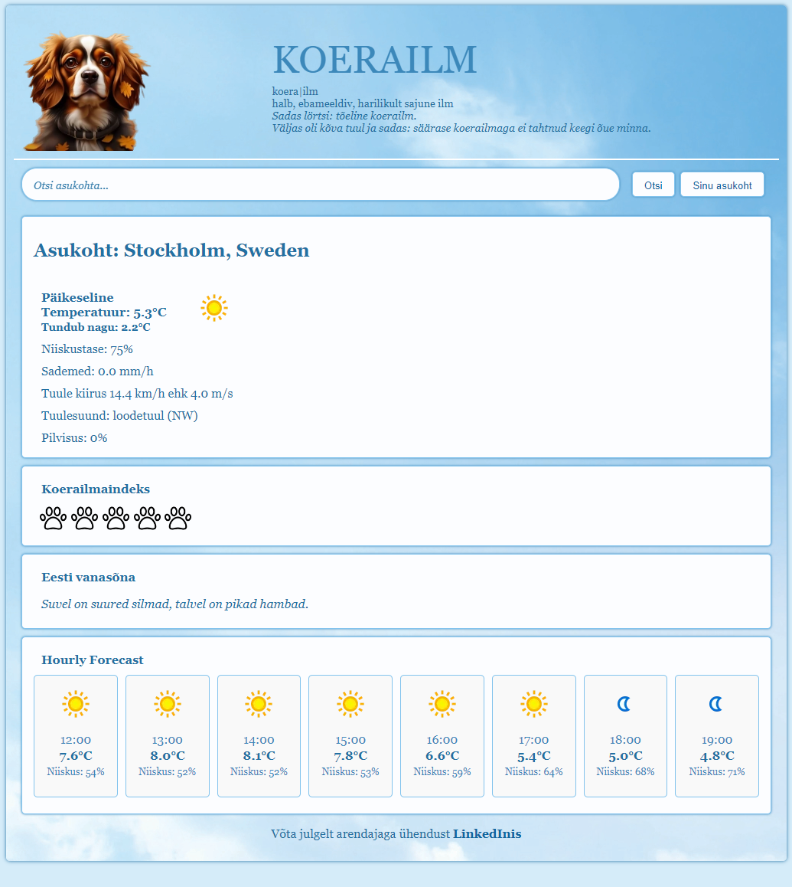

# Koerailm weather app - final project for SDA Python Course "PythonRemoteEE23"
Koerailm is a fun weather app with a dog weather index and Estonian folk sayings, as well as current weather and hourly
forecast. It allows users to search for a location by name or get user's current location. Koerailm is the final project
for SDA Python Course "PythonRemoteEE23". It started as a group project, but then became a solo project.


_______________________________________________________________________________________________________________________
## Technologies used
* Language: Python 3.12
* Framework: Django 5.1.1
* GIT

_______________________________________________________________________________________________________________________
## Installation steps
### 1. Clone the repository:
```bash
git clone https://github.com/KarolaRaid/koerailm-weather-app
cd koerailm-weather-app
```
### 2. Create and activate virtual environment
#### On Windows
```bash
python -m venv venv
venv\Scripts\activate
```
#### On MacOS/Linux
```bash
python3 -m venv venv
source venv/bin/activate
```
### 3. Install dependencies
```bash
pip install -r requirements.txt
```
### 4. Create a .env file
In the root directory of the project, create a .env file with the following content:
```bash
DJANGO_SECRET_KEY='your-secret-key-here'
# Get your Django secret key:
from django.core.management.utils import get_random_secret_key
print(get_random_secret_key())

DB_NAME=your-database-name
DB_USER=your-database-username
DB_PASSWORD=your-database-password
DB_HOST=localhost
DB_ENGINE="django.db.backends.mysql"
DB_PORT=3306

WEATHER_API_KEY=your-weather-api-key-here # Get your unique key from https://www.weatherapi.com/
```
### 5. Configure settings.py
```bash
DATABASES = {
    "default": {
        "ENGINE": config("DB_ENGINE"),
        "NAME": config("DB_NAME"),
        "USER": config("DB_USER"),
        "PASSWORD": config("DB_PASSWORD"),
        "HOST": config("DB_HOST"),
        "PORT": config("DB_PORT"),
    }
}
```

### 6. Apply migrations
```bash
python manage.py migrate
```

### 7. Create a superuser
To access the Django admin panel, you need to create a superuser account:
```bash
python manage.py createsuperuser
```

### 8. Start the development server
You can now run the development server using the following command:
```bash
python manage.py runserver
```
Visit http://127.0.0.1:8000/ in your browser to see the website or http://127.0.0.1:8000/admin/ to view the admin panel.

_______________________________________________________________________________________________________________________
## Testing
Run the tests with the following command:
```bash
pytest
```
_______________________________________________________________________________________________________________________
## Credits
This project was developed by Karola Raid with some smaller contributions from Alvar Lillemägi and Rauno Pole.